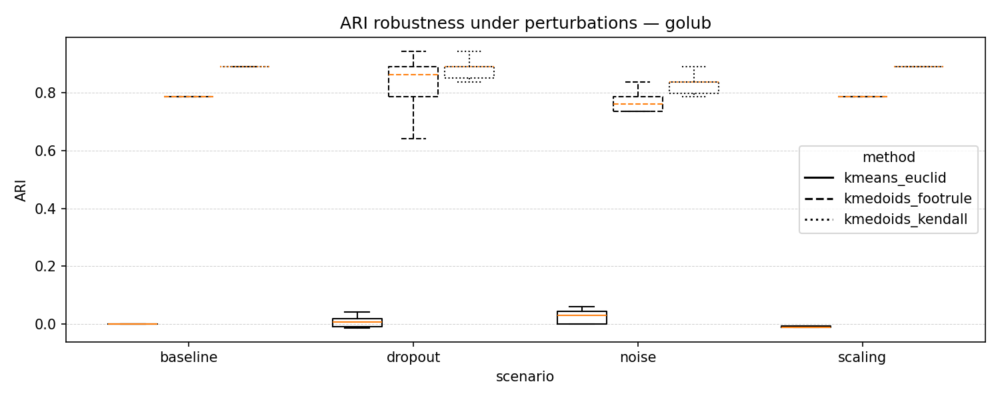
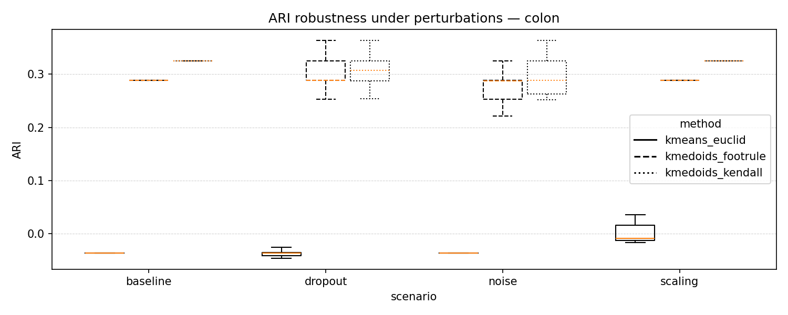
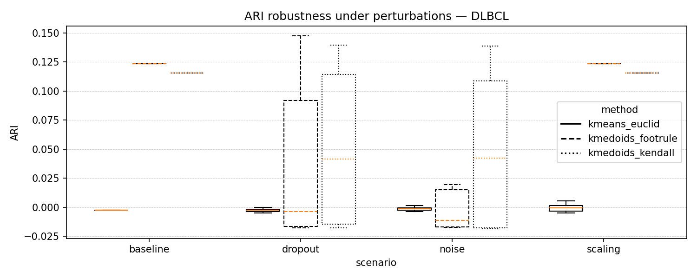

# Rank-based Relational Clustering – Feasibility Study

This repository provides a **minimal, reference implementation** of rank-based relational clustering
used as a preliminary feasibility study for an NCN OPUS proposal.
The goal is to demonstrate **robustness and practical feasibility**, not to provide a fully optimized system.

The experiments compare a standard value-based baseline (k-means with Euclidean distance)
against relational clustering based on **k-medoids operating in rank space**
using **Footrule** and **Kendall** distances.

---

## Key characteristics

- Unsupervised, label-agnostic preprocessing  
- Rank-based representation invariant to monotonic transformations  
- Explicit robustness evaluation under controlled perturbations  
- Simple, transparent Python implementation  
- Executable on a standard consumer-grade laptop (no GPU, no parallelization)

---

## Datasets

The study uses three **public, widely adopted gene expression benchmarks**
distributed via **Bioconductor**, commonly used in methodological work:

- **Golub ALL/AML**
- **Colon cancer**
- **DLBCL (Diffuse Large B-Cell Lymphoma)**

These datasets represent increasing difficulty and decreasing signal strength,
reducing the risk of cherry-picking or dataset-specific tuning.

Original datasets are provided in the `data/` directory for full reproducibility.

---

## Experimental protocol

### Feature filtering
To control dimensionality without supervision, the **top 500 genes**
were selected using **median absolute deviation (MAD)**.
All downstream analyses operate exclusively on this reduced representation.

### Clustering methods
- **k-means (Euclidean distance)** – value-based baseline  
- **k-medoids + Footrule distance** (rank space)  
- **k-medoids + Kendall distance** (rank space)

The number of clusters is set to the true number of biological classes.

### Perturbation scenarios
Robustness is evaluated under four scenarios:

1. **Baseline** (no perturbation)
2. **Feature dropout** (random removal of a fraction of features)
3. **Additive noise** (Gaussian noise)
4. **Monotonic scaling** (sample-wise rescaling of expression values)

Each perturbation scenario is repeated multiple times (typically 20 runs),
and clustering quality is assessed using **Adjusted Rand Index (ARI)**.

---

## Results

The following figures summarise clustering robustness under controlled
perturbations for three benchmark datasets. Results are reported as
Adjusted Rand Index (ARI) distributions over repeated runs.

### Golub (ALL/AML)


### Colon cancer


### DLBCL


Aggregated ARI statistics (mean and range over repeated runs) are provided in:

- `results/step8_summary.csv`

This file contains per-dataset, per-scenario summaries and can be used
for independent inspection or reproduction of plots.

Key observations:
- Value-based k-means fails to recover meaningful structure across datasets
- Rank-based relational clustering achieves substantially higher stability
- Kendall distance is consistently more robust than Footrule
- Monotonic scaling does not affect rank-based methods, as expected

---

## Computational performance

All experiments were executed using a **non-optimized Python implementation**
on a standard consumer-grade laptop.

- Full Kendall distance matrices (up to ~200 samples) computed within minutes
- Footrule distance computation is roughly an order of magnitude faster
- k-medoids clustering on cached distance matrices completes in **under one second**
- Overall, Kendall-based clustering is approximately:
  - **10× slower than Footrule**
  - **~100× slower than k-medoids assignment alone**

These results demonstrate practical feasibility at moderate scale
and motivate dedicated optimization and scalability strategies.

---

## Repository structure

```
.
├── data/                 # Original datasets (Bioconductor)
│   ├── golub/
│   ├── colon/
│   └── DLBCL/
├── results/              # Aggregated summaries and plots
│   ├── fig_step8_golub.png
│   ├── fig_step8_colon.png
│   └── fig_step8_DLBCL.png
│   ├── step8_summary.csv
├── step1_io_sanity.py
├── step2_mad_top500.py
├── step3_rank_encoding.py
├── step4_pair_distances.py
├── step5_dist_matrices.py
├── step6_baseline_clustering.py
├── step7_perturbations.py
├── step8_aggregation_and_plots.py
├── requirements.txt
└── README.md
```

Scripts are designed to be run sequentially (`step1` → `step8`).

---

## Usage

```bash
pip install -r requirements.txt
python step1_io_sanity.py
python step2_mad_top500.py
python step3_rank_encoding.py
python step4_pair_distances.py
python step5_dist_matrices.py
python step6_baseline_clustering.py
python step7_perturbations.py
python step8_aggregation_and_plots.py
```

---

## Scope and limitations

This repository is intended as a **feasibility and robustness demonstration**.
It deliberately avoids:

- GPU acceleration
- Parallel implementations
- Advanced optimization techniques

These aspects are addressed as part of the planned research tasks.

---

## License

MIT License.

---

## Author

Marcin Czajkowski  
Białystok University of Technology
